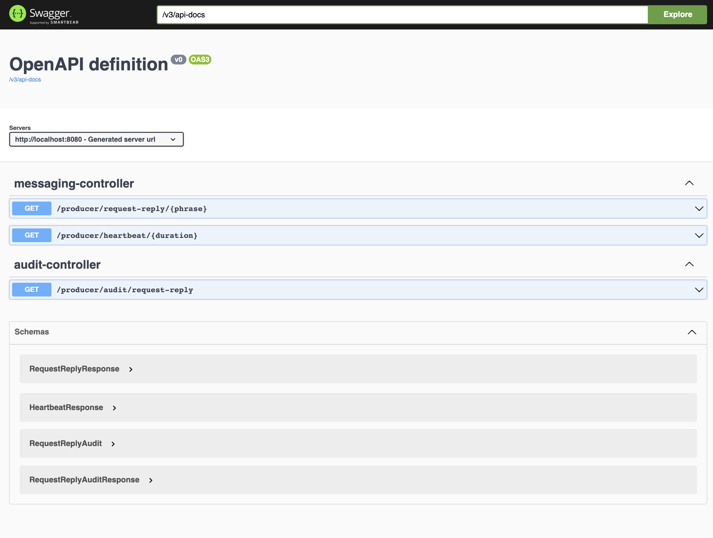

# Messaging system
Messaging system with one `producers` and two `consumers` based on RabbitMQ

## System Services
- Messaging Producer Service
- Messaging Heartbeat Consumer Service
- Messaging Reply Consumer Service
- 
## Services set up via docker-compose
- Build Docker images via command(it will take time)
```bash
./gradlew clean build bootBuildImage
```
- Start system with docker compose
```bash
docker-compose -f docker-compose.yml up
```
## Service set up via docker-compose + IntelliJ
- Start infra system with docker compose
```bash
docker-compose -f docker-compose-infra.yml up
```
- Start `MessagingProducerApplication` application with IntelliJ or
```bash
./gradlew :messaging-producer:clean build :messaging-producer:bootRun 
```
- Start `MessagingHeartbeatApplication` application with IntelliJ or
```bash
./gradlew :messaging-heartbeat-consumer:clean build :messaging-heartbeat-consumer:bootRun 
```
- Start `MessagingReplyApplication` application with IntelliJ or
```bash
./gradlew :messaging-reply-consumer:clean build :messaging-reply-consumer:bootRun 
```

## Messaging Flow
#### Heartbeat flow
```
Call to Producer Service ---> MessageBroker ---> Message Handling via Heartbeat Consumer
```
#### Request Reply flow
```
Call to Producer Service ---> MessageBroker ---> Message Handling via Reply Consumer Service ---> MessageBroker ---> Message Handling via Producer Service

```
## Open API documentation
- Open 'http://{server}:{port}/api-docs' to view documentation in JSON format for TDM service
```bash
http://localhost:8080/v3/api-docs
```
- Open 'http://{server}:{port}/swagger-ui.html' to view api endpoints for TDM service
```bash
http://localhost:8080/swagger-ui/index.html
```

<p align="left">
    
</p>

